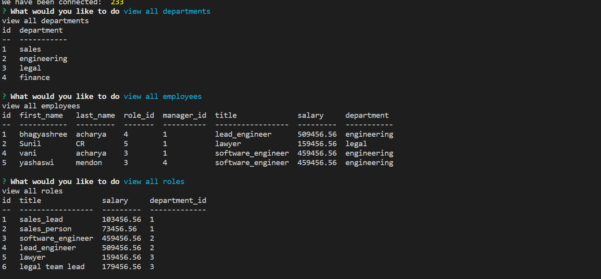

# Employee Tracker

## Description
 To view and manage the departments, roles, and employees in acompany to organize and plan business.

## Table of Contents
- [Installation](#installation)
- [Usage](#usage)
- [License](#license)
- [Contribution](#contribution)
- [Tests](#tests)
- [Questions](#questions)

## Installation
npm install inquirer mysql console.table

## Usage
User can add and delete employee,role,department and also can update employee role and employee manager based on the specific id enrolled to each employee.

## License
none

## Contribution
Single Contributor

## Tests
node index.js

## Questions
#### Link to GitHub page: [GitHub_Link](https://github.com/Bhagyashree9402)

#### Email: bhagyashree9402@gmail.com

## Video: [link](https://drive.google.com/file/d/1AkQFxOivz01rA2xnXZjXbzbvsoiR41D4/view)

## Demo Screenshot:
